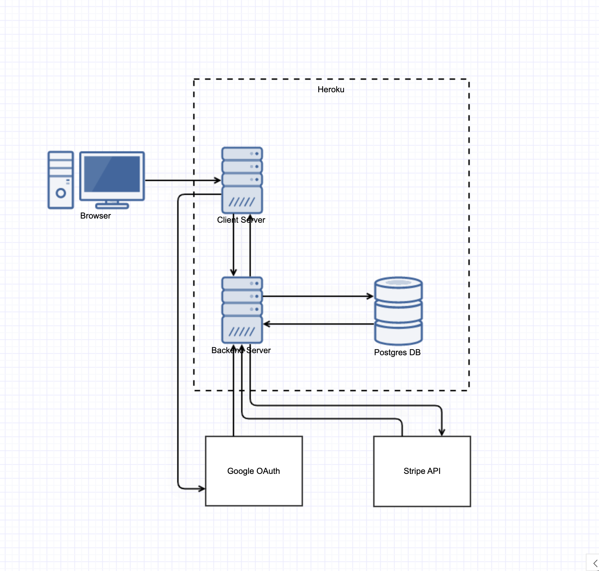

# Next-React Frontend for Restaurants

[Restaurant App](https://restauranteur-client.herokuapp.com/)
[Admin Console](https://restauranteur-strapi.herokuapp.com/admin/)


## use yarn and then yarn dev to run the code

Do NOT do a yarn build since we are not going to deploy it anywhere
Exercise03 is full rendering
index3.js (Data is hardcoded)
index.js (Get data from Strapi using Apollo and GraphQL)
restaurantList.js is Web Component to render restaurants

This is a [Next.js](https://nextjs.org/) project bootstrapped with [`create-next-app`](https://github.com/vercel/next.js/tree/canary/packages/create-next-app).

## Getting Started

First, run the development server:

```bash
npm run dev
# or
yarn dev
```

Open [http://localhost:3000](http://localhost:3000) with your browser to see the result.

You can start editing the page by modifying `pages/index.js`. The page auto-updates as you edit the file.

## Network Diagram 



## Learn More

To learn more about Next.js, take a look at the following resources:

- [Next.js Documentation](https://nextjs.org/docs) - learn about Next.js features and API.
- [Learn Next.js](https://nextjs.org/learn) - an interactive Next.js tutorial.

You can check out [the Next.js GitHub repository](https://github.com/vercel/next.js/) - your feedback and contributions are welcome!

## OAuth 
Configured at [Google Cloud Console](https://console.cloud.google.com/apis/credentials?project=restauranteur-337508)

## Deploy on Vercel

The easiest way to deploy your Next.js app is to use the [Vercel Platform](https://vercel.com/import?utm_medium=default-template&filter=next.js&utm_source=create-next-app&utm_campaign=create-next-app-readme) from the creators of Next.js.

Check out our [Next.js deployment documentation](https://nextjs.org/docs/deployment) for more details.

## Deploy on Heroku 

1. Build docker images

```bash 
make build 
```

2. Push images to Heroku

```bash
make heroku-push
```

3. Deploy Application

```bash
make heroku-release
```

## Backend API Documentation 

- [REST Documentation](https://docs.strapi.io/developer-docs/latest/developer-resources/database-apis-reference/rest-api.html)
- [GraphQL Documentation](https://docs.strapi.io/developer-docs/latest/developer-resources/database-apis-reference/graphql-api.html)
- [Interactive Documentation](https://restauranteur-strapi.herokuapp.com/graphql)

## Features 

- [x] Create an account with an email address and password
  - [x] A success message is received upon account creation
  - [x] The email address or username appears at the top right corner when logged in
- [x] Log in to account
  - [x] The user can log in with an email address, password, or OAuth2 authentication
  - [x] The user can log out of the account
- [x] Home page
  - [x] A list of restaurants is displayed
- [x] Search functionality
  - [x] User can search for restaurants from the home page
  - [x] User can search for dishes from a restaurant page
- [x] Cart functionality
  - [x] User can add dishes to cart
  - [x] User can remove dishes from cart
  - [x] Price updates automatically
  - [x] User can update quantity in cart
- [x] Checkout
  - [x] User can check out with Stripe
  - [x] User receives success message
  - [x] Input fields are validated